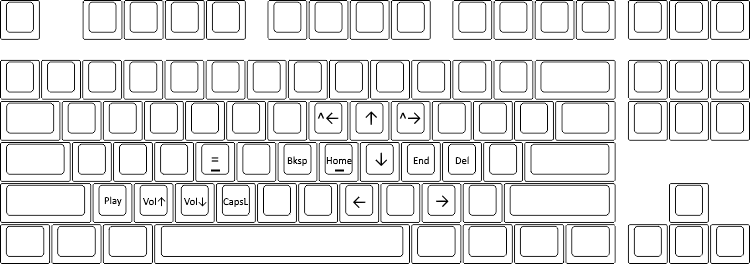

# hotkeys

The [AutoHotKey](https://www.autohotkey.com/) scripts that I use for software development

## Description
I found that a lot of keys that you commonly have to press for software development, like parentheses or equals, were
awkward to reach while writing code.

I also didn't like having to move my right hand to the arrow keys for quick navigation.

These scripts are my solution to these inconveniences.

## Capslock Remap

The `capslock_remap.ahk` script allows you to remap all key functions upon pressing an activation key.

So when I hold down `CapsLock` my keys are rebound to:

This allows me to quickly navigate code without moving my hands from the touch typing position.

The key binds also work with key modifiers like `shift` and `ctrl`, meaning I can select and move blocks of code easily

The script is written to be easily configurable, allowing you to change the activation key and the activated functions
of the other keys with minimal coding.

The keys are bound to AutoHotKey functions, meaning you can rebind keys to do anything you like.

Note that in this repo the activation key may be `End` as I have the `CapsLock` key rebound to that in the registry. Also the reason the remapped arrow keys aren't in the normal arrow key orientation is because my initial implementation only had `Up`, `Down`, `Home`, and `End` and I got used to that before adding more and ended up keeping it. I would recommend changing the keys to the normal orientation before starting to use this.

## Shift Remap

The `shift_remap.ahk` script does two things:

* Maps `shift` + `space` to `_`
* Maps tapping left and right `shift` to `(` and `)` respectively

The underscore remap makings typing in snake_case really easy and the parentheses remaps make it easy to type
parentheses without taking your hands off the touch typing positions

Shift otherwise operates as normal, without sending parentheses when used in conjunction with another key.
